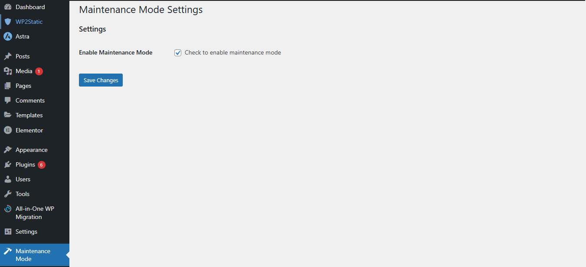

# Maintenance Mode - WordPress Plugin

A simple **Maintenance Mode Plugin** for WordPress. It allows admins to enable a **custom maintenance page** with a **countdown timer**.

## Features

✅ Enable/Disable Maintenance Mode from Admin Panel  
✅ Custom **maintenance page** with styling  
✅ **Countdown timer** to indicate when the site will be back  
✅ Only admins can access the website while in maintenance mode

## Installation

1. Upload `maintenance-mode` to `/wp-content/plugins/`
2. Activate the plugin in **WordPress > Plugins**.
3. Configure settings under **"Maintenance Mode"** in the Admin Menu.

## License

This plugin is released under the **GPL-2.0 License**.
